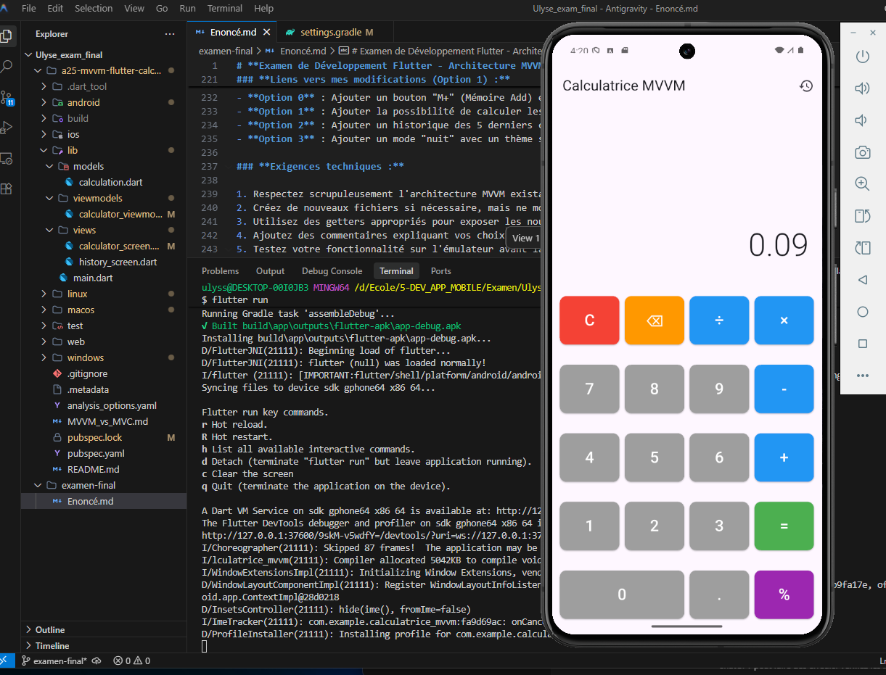

# **Examen de Développement Flutter - Architecture MVVM**

Ulysse Borris


---

### **Partie 1 : Questions théoriques (30%)**

 **Question 1 : Architecture MVVM**

1. Nommez les trois composants de l'architecture MVVM et décrivez la responsabilité de chacun dans le contexte de l'application calculatrice.

**RÉPONSE :**

- i. Model : COntient model de données.

- ii. View : le view est le dossier qui contient la les widget et tout les composante visuelle de l'application.

- iii. ViewModel : Dans la calculatrice, le ViewModel expose les données prêtes à être affichées ; c’est le cerveau qui effectue les calculs.

---

2. Expliquez le rôle de `ChangeNotifier` et `notifyListeners()` dans le ViewModel. Quelle est l'alternative à `ChangeNotifier` dans Flutter ?

**RÉPONSE :**

- i. ChangeNotifier : C'est une classe de base qui permet au ViewModel d'être écouté par le view pour détecter les changements d'état.

- ii. C'est la méthode qui lance le signal pour avertir le view que les données ont changé et qu'elle doit se rafraîchir.

- iii.  Alternative :Riverpod

---

3. Pourquoi utilise-t-on `Consumer<CalculatorViewModel>` au lieu de `Provider.of<CalculatorViewModel>` dans certaines parties de la View ?

**RÉPONSE :**

- i.  Pour éviter les redondances de code. en ne reconstruisant que la partie spécifique du widget qui l'utilise lorsque les données changent, contrairement à Provider.of qui reconstruit tout le widget parent.

---
---
---

**Question 2 : Séparation des préoccupations**

1. La classe `Calculation` dans le dossier `models/` est immuable (tous les champs sont `final`). Quel est l'avantage de cette immutabilité dans le contexte de l'architecture MVVM ?

**RÉPONSE :** 
- i. une fois qu'un calcul est effectué et ajouté à l'historique, il ne peut plus être modifié accidentellement par une autre partie de l'application. c'est une question de sécurité et pour éviter les bugs.

---

2. Pourquoi les variables dans `CalculatorViewModel` sont-elles préfixées par un underscore (`_display`, `_history`, etc.) ? Quelle règle de Dart cela respecte-t-il ?

**RÉPONSE :** 
- i.  L'underscore (_) au début des variables les rend privées ("library-private") au fichier dans lequel elles sont déclarées. tout les language on leur propre règle pour les variables privées. En Java, on écrit private, et en Python, on utilise aussi un underscore comme en dart.

---

3. Dans `calculator_viewmodel.dart`, la méthode `calculateResult()` contient un `switch` sur `_pendingOperation`. Comment cette logique pourrait-elle être refactorée pour respecter le principe Open/Closed (SOLID) ?

**RÉPONSE :** 
- i.  On peut utiliser le pattern Strategy. On n’a pas vu ça en Flutter, haha =D, mais on l’a vu dans notre cours d’algorithmique Python avec Vincent.

    - A. On créerait une interface commune (ex: Operation) avec une méthode calculer().
    - B. On créerait une classe séparée pour chaque opération (ex: Addition, Soustraction) qui implémente cette interface.
    - CLe ViewModel appellerait juste la méthode calculer() sur l'objet, ce qui élimine le **switch** et permet d'ajouter des opérations sans modifier le code existant.

---
---
---

 **Question 3 : Comparaison d'architectures**

1. Comparez l'approche `setState()` de `StatefulWidget` avec l'approche `notifyListeners()` de `ChangeNotifier`. Donnez un avantage et un inconvénient pour chaque approche.

**RÉPONSE :** 
- i.  setState() est plus simple et rapide, mais il peut causer des redondances de code. notifyListeners() est plus complexe, mais il permet de suivre les changements d'état de manière plus efficace. C’est encore une question de bien appliquer les principes algorithmiques SOLID.

---

2. Si vous deviez migrer cette application vers une architecture BLoC, quels seraient les principaux changements à apporter au ViewModel ?

**RÉPONSE :** 
- i.  On a pas vu les architecture BLoC. mais d'après ce que j'ai trouver on défini cela comme un  un pattern basé sur les Streams. et les Streams sont des flux de données qui permettent de suivre les changements d'état de manière plus efficace. donc je pence que la solution serait : 

 de remplacer les méthodes du ViewModel (ce qu'on appelle pour faire une action) par des Événements qu'on envoie dans le flux, et de remplacer les variables par des États que le flux nous renvoie.

---

3. Expliquez comment `Provider` fonctionne dans `main.dart`. Que se passe-t-il si on omet le `ChangeNotifierProvider` ?

**RÉPONSE :** 
- i.  Dans main.dart de la calculatrice le provider est le return **ChangeNotifierProvider()**. Si on l'enlève, l'application va crasher    dès qu'elle essaiera d'accéder au ViewModel, car elle ne pourra pas le trouver dans l'arbre des widgets

---
---
---
---

### **Partie 2 : Correction de code (30%)**

 **Code à analyser :**

```dart
// Fichier : buggy_calculator_viewmodel.dart

import 'package:flutter/material.dart';

class BuggyCalculatorViewModel extends ChangeNotifier {
  String display = '0';  // Ligne modifiée
  List<String> history = [];  // Ligne modifiée

  void inputNumber(String number) {
    if (display == '0') {
      display = number;
    } else {
      display = display + number;  // Ligne modifiée
    }
    // Ligne manquante
  }

  void calculateResult() {
    // Code simplifié problématique
    double result = 0;
    if (display.contains('+')) {
      List<String> parts = display.split('+');
      result = double.parse(parts[0]) + double.parse(parts[1]);
    }
    display = result.toString();
    history.add(display);
    // Ligne manquante
  }

  void clearAll() {
    display = '0';
    // Ligne manquante
  }
}
```

### **Questions de correction :**

1. Identifiez 5 problèmes architecturaux ou techniques dans ce code.
2. Pour chaque problème, expliquez pourquoi c'est une mauvaise pratique dans le contexte MVVM.

**RÉPONSE :** 
- i. Display devrai etre un atribut privé et non modifiable. " _display " Pour protéger les données contre modification externe.

- ii.  List<String> history = []; devrait être immuable (final), car c’est un history, car il n’est pas censé être modifié.

- iii. ligne 120 (display = display + number;) ce n'est pas vraiment une erreur mais on pourrais ecrir _display += number; pour simplifier, et surtou sans oublier le underscore (_) pour le privé.

- iv. a la ligne 122 et 134 et 139  il nous manque l'appel à notifyListeners() sans ca , l'écran ne se mettra jamais à jour

- v. Ajouter un getter pour display (String get display => _display;) car il est privé donc on a besoin de getter pour accéder à sa valeur.

 ---

3. Réécrivez le code corrigé en respectant l'architecture MVVM et les bonnes pratiques Flutter.

**code corrigé :** 

```dart
import 'package:flutter/material.dart';

class BuggyCalculatorViewModel extends ChangeNotifier {
  String _display = '0';  // Le _
  final List<String> history = [];  // Lajout du final

  String get display => _display;  // l'ajout du getterr

  void inputNumber(String number) {
    if (_display == '0') { // le _
      _display = number; // Le _
    } else {
      _display += number;  // simplification et ajout du _
    }
    notifyListeners(); // le plus important ajout 
  }

  void calculateResult() {
    // Code simplifié problématique
    double result = 0;
    if (_display.contains('+')) {
      List<String> parts = _display.split('+');
      result = double.parse(parts[0]) + double.parse(parts[1]);
    }
    _display = result.toString();
    history.add(_display);
    notifyListeners(); // ajout du notifyListeners()
  }

  void clearAll() {
    _display = '0';
    notifyListeners(); // encore ajout du notifyListeners()
  }
}

```


4. Proposez un test unitaire pour la méthode `calculateResult()` qui couvre un cas d'erreur potentiel.


---

### **Partie 3 : Développement (40%)**

**Consigne :**

Améliorez l'application calculatrice existante en ajoutant **une seule** des fonctionnalités suivantes. Choisissez la fonctionnalité qui correspond à votre numéro d'étudiant modulo 4 :

Haha, j’adore ! Alors, mon numéro d’étudiant est 2496249. Je vais faire : 49 ÷ 4 = 12.25, 12 × 4 = 48, donc il reste **1** 

---

- **Option 1** : Ajouter la possibilité de calculer les pourcentages (bouton "%") OK
### **Liens vers mes modifications (Option 1) :**
- **Logique (%)** : [calculator_viewmodel.dart : Ligne 108](../a25-mvvm-flutter-calculator/lib/viewmodels/calculator_viewmodel.dart#L108)
- **Bouton (%)** : [calculator_screen.dart : Ligne 102](../a25-mvvm-flutter-calculator/lib/views/calculator_screen.dart#L102)
- **Switch Case** : [calculator_screen.dart : Ligne 166](../a25-mvvm-flutter-calculator/lib/views/calculator_screen.dart#L166)


### **NOTE**
error dans mon terminal
Android Gradle Plugin version 8.1.0 is lower than Flutter's minimum supported version ... 8.1.1

J’ai Modifier le fichier android/settings.gradle pour passer la version de 8.1.0 à 8.1.1, car je n’ai pas la même version de Flutter que toi. Donc, si vous faitea un test run pour que cela fonctionne chez toi, tu devras également repasser à la version 8.1.0 dans le fichier android/settings.gradle. Mais j’ai ajouté une photo à la fin de l’émulateur en marche.


### **Preuve de fonctionnement :**



---

- **Option 0** : Ajouter un bouton "M+" (Mémoire Add) et "MR" (Memory Recall) avec une mémoire simple
- **Option 1** : Ajouter la possibilité de calculer les pourcentages (bouton "%") OK
- **Option 2** : Ajouter un historique des 5 derniers calculs affiché directement sur l'écran principal
- **Option 3** : Ajouter un mode "nuit" avec un thème sombre activable/désactivable

### **Exigences techniques :**

1. Respectez scrupuleusement l'architecture MVVM existante
2. Créez de nouveaux fichiers si nécessaire, mais ne modifiez pas le fonctionnement existant
3. Utilisez des getters appropriés pour exposer les nouveaux états
4. Ajoutez des commentaires expliquant vos choix architecturaux
5. Testez votre fonctionnalité sur l'émulateur avant la fin de l'examen


### **Points d'évaluation :**

- **Architecture** : Respect du pattern MVVM, séparation claire des responsabilités
- **Fonctionnalité** : La fonctionnalité ajoutée fonctionne correctement
- **Code qualité** : Code propre, commenté, nommage approprié
- **Gestion d'état** : Utilisation correcte de notifyListeners() et Consumer

---

